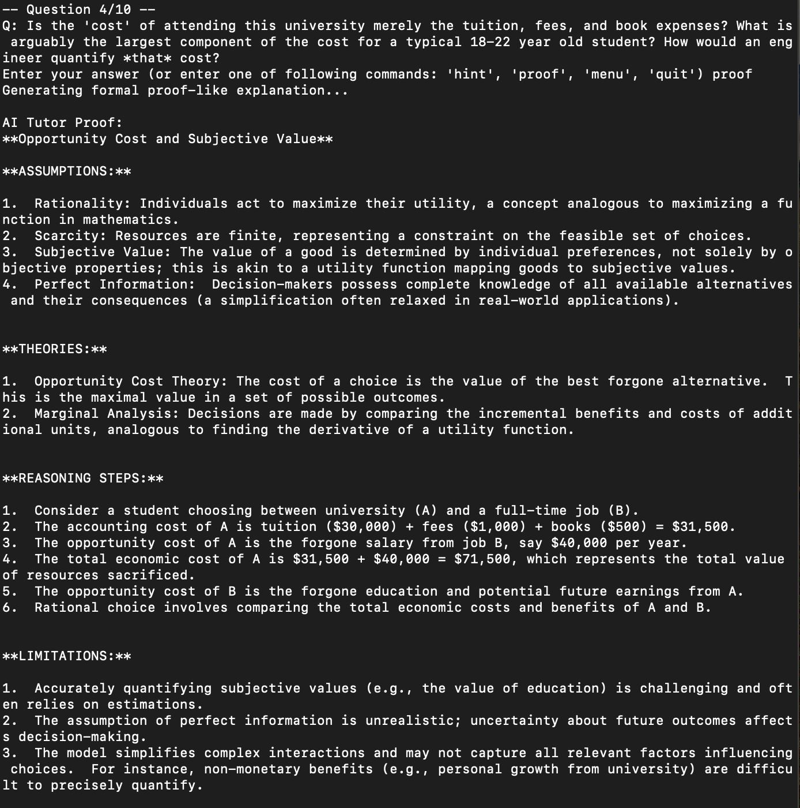
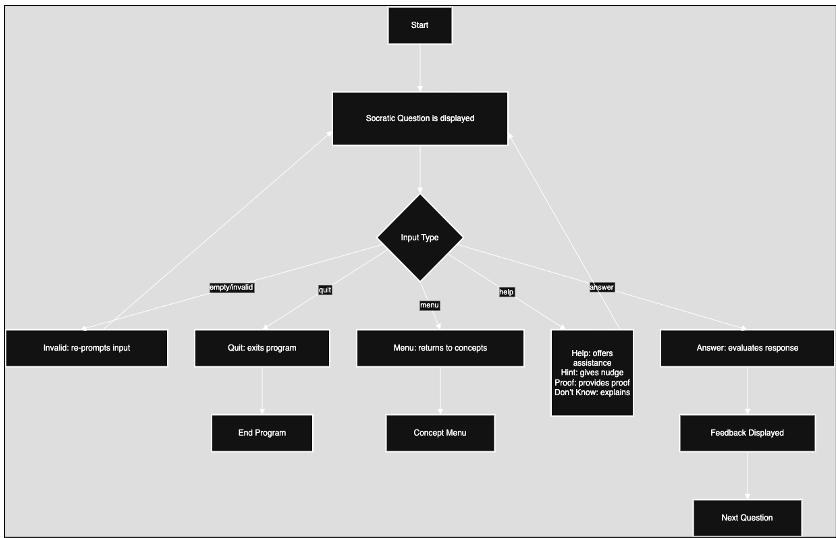
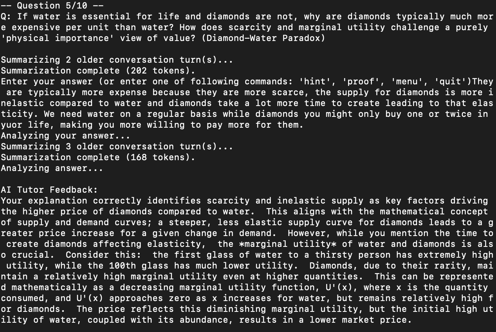

AI-Powered Socratic Economics Tutor for STEM Students

<p align="center">
  
</p>


## 🚀 Overview

This project introduces an AI-powered Socratic tutoring system designed to help STEM students bridge the gap between their disciplinary reasoning (e.g., mathematics, physics, engineering) and economic thinking. Many STEM students struggle with economics not due to a lack of intelligence, but because the mental frameworks and jargon used in economics differ from those in STEM disciplines.

Built using **Google’s Gemini Flash model**, the tutor engages students in Socratic dialogue, provides discipline-tailored feedback, and encourages structured reasoning — helping learners translate economic concepts into their own logic and language.

---

## 🎯 Goals

* **Bridge disciplinary gaps**: Help STEM students understand economic concepts using their own mental models.
* **Promote deep understanding**: Encourage logical reasoning over rote answers via structured, dialog-driven learning.
* **Enhance interdisciplinary learning**: Empower students to confidently approach economic problems from a STEM-informed perspective.
* **Develop a scalable EdTech platform**: Lay the groundwork for personalized, adaptive learning systems in economics and beyond.



---

## 🧠 How It Works

The tutor uses a **custom system prompt** architecture that adapts to each student’s background discipline. A core prompt template structures each explanation using:

* **ASSUMPTIONS**: Lists explicit and hidden assumptions, framed in the student's disciplinary language.
* **THEORIES**: Describes major economic theories relevant to the topic.
* **REASONING STEPS**: Provides a logical, step-by-step derivation with examples and numerical illustrations.
* **LIMITATIONS**: Identifies the boundaries and challenges of applying the concept, especially across disciplines.

This mirrors how STEM students typically reason—breaking down problems systematically, following logic chains, and analyzing edge cases.

---

## 🧪 Features

* ✅ Tailored explanations based on academic background
* ✅ Custom Q\&A bank to address discipline-specific misconceptions
* ✅ Iterative prompt engineering with feedback from economics faculty
* ✅ Socratic dialogue to guide thinking rather than provide answers
* ✅ Potential classroom integration, with future RAG + UI support planned

<p align="center">
  
</p>

---

## 🛠️ Installation & Setup

> ⚠️ This project currently assumes use with Gemini Flash via Google’s API.

1. **Clone the repository:**

   ```bash
   git clone https://github.com/yourusername/econ-socratic-tutor.git
   cd econ-socratic-tutor
   ```

2. **Set up a virtual environment:**

   ```bash
   python3 -m venv venv
   source venv/bin/activate
   ```

3. **Install dependencies:**

   ```bash
   pip install -r requirements.txt
   ```

4. **Configure API credentials:**

   Create a `.env` file with your Gemini API key:

   ```
   GEMINI_API_KEY=your_api_key_here
   ```

5. **Run the tutor engine:**

   ```bash
   python main.py
   ```

---

## 📦 Project Structure

```
econ-socratic-tutor/
│
├── prompts/                # Structured prompts by discipline
├── data/                   # Misconception Q&A bank
├── tutor_engine/           # Main logic for dialogue and explanation generation
├── tests/                  # Unit tests
├── .env.example            # API key template
├── requirements.txt        # Python dependencies
└── README.md               # Project overview
```

---

## 📊 Future Roadmap

* [ ] Adaptive learning paths (“Choose Your Own Adventure” style)
* [ ] Integration with Retrieval-Augmented Generation (RAG)
* [ ] User-friendly web interface
* [ ] Personalization based on real-time data and performance tracking
* [ ] Classroom and tutoring center deployment

---

## 🙏 Acknowledgments

Thanks to Professors **Katherine Elkins** and **Jon Chun** for guidance, and to the Kenyon College **Economics Department** — especially **Katie Black, Jay Corrigan, PJ Glandon, and Will Melick** — for critical insight and feedback.

---

## 📄 License

MIT License. See `LICENSE` for details.

---

Would you like this exported into a markdown file or added to a repo structure with sample code and prompt templates?

README.md
Displaying README.md.
